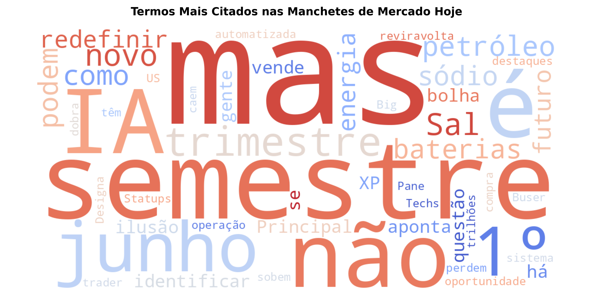

# Automação de Web Scraping e NLP para Manchetes Econômicas 🌐🕵️‍♂️

Este repositório armazena uma solução automatizada em Python desenvolvida no Google Colab para extrair, limpar, estruturar e analisar visualmente dados textuais de portais econômicos que não oferecem APIs nativas.

## Como Funciona o Pipeline de Dados (ETL)?
Como a internet é composta por dados não estruturados (HTML), o script funciona como um pipeline automatizado que realiza três etapas fundamentais:

1. **Extraction (Extração):** Envia uma requisição HTTP controlada simulando o comportamento de um navegador padrão (*User-Agent*) para capturar o código-fonte brutos da seção de mercados.
2. **Transformation (Transformação e NLP):** O algoritmo varre o Document Object Model (DOM) do HTML via `BeautifulSoup` para isolar as manchetes. Em seguida, aplica uma higienização textual, removendo ruídos informacionais e filtrando *Stopwords* (artigos, preposições e pronomes que não agregam valor à análise semântica).
3. **Loading (Carga e Persistência):** Consolida os metadados em um DataFrame do Pandas, exportando um dataset estruturado em formato `.csv` e gerando uma análise visual de frequência de termos.

---

## Justificativa Teórica e Técnica

### 1. Robustez contra Bloqueios (HTTP Headers e Emulação)
Servidores corporativos frequentemente bloqueiam requisições automatizadas padronizadas para mitigar ataques cibernéticos ou sobrecarga. Este projeto implementa cabeçalhos estruturados (*Request Headers*) para emular o comportamento de tráfego humano legítimo, um pilar fundamental em arquitetura de dados e raspagem ética (*Politeness Policy*).

### 2. Processamento de Linguagem Natural (NLP) e Stopwords
A mera contagem de palavras em textos brutos gera distorções, pois conectivos (como "de", "e", "para") aparecem com maior frequência. Ao mapear e tokenizar as manchetes removendo uma matriz customizada de *Stopwords*, o algoritmo realiza um tratamento de dados avançado, isolando apenas os reais direcionadores de sentimento do mercado financeiro (ex: nomes de ativos, órgãos governamentais ou indicadores macroeconômicos).

---

## 🛠️ Tecnologias Utilizadas
* **Python 3**
* **Requests:** Gerenciamento e emulação de requisições de rede HTTP.
* **BeautifulSoup 4:** Parsing estrutural e navegação de nós de árvores DOM em HTML.
* **Pandas:** Estruturação, limpeza de duplicadas e persistência matricial dos dados coletados.
* **WordCloud & Matplotlib:** Mineração de texto, cálculo de frequência léxica e renderização gráfica avançada.

---

## 📈 Resultados Obtidos

### 1. Dataset Estruturado (.CSV)
Ao rodar o pipeline, o algoritmo gera uma base de dados limpa. O arquivo de saída `noticias_mercado_bruto.csv` segue o padrão analítico abaixo, pronto para modelos preditivos de séries temporais ou modelos de classificação de sentimentos:

| Data_Extracao | Headline | Link |
| :--- | :--- | :--- |
| 2026-06-30 10:45:00 | Ibovespa avança com dados de inflação... | https://www.infomoney.com.br/... |
| 2026-06-30 10:45:02 | Dólar recua perante mercado exterior... | https://www.infomoney.com.br/... |

### 2. Análise Visual de Frequência de Termos (Nuvem de Palavras)
Além da base tabular, o script processa o volume léxico das manchetes em tempo real para compor uma Nuvem de Palavras (*WordCloud*). O tamanho de cada termo reflete diretamente a sua recorrência nos portais, entregando um panorama imediato de quais assuntos ou ativos estão capturando a atenção do mercado no dia:

---

## Interpretação dos Resultados

A mineração de texto (*Text Mining*) aplicada sobre o fluxo informativo do dia nos permite extrair três insights estratégicos sobre a psicologia coletiva do mercado:

### 1. Identificação de Temas Dominantes (Clustering Conceitual)
Ao observar os termos de maior escala na nuvem de palavras, isolamos instantaneamente quais são os *market drivers* da sessão. Se palavras como "Juros", "Copom" ou "Fed" ganham destaque, o mercado está operando sob a dinâmica de política monetária. Se termos como "Balanço", "Lucro" ou "Dividendos" dominam, o foco dos investidores está na temporada de resultados corporativos (*micro-driven*).

### 2. Redução de Assimetria Informacional
Em vez de um analista ler manualmente dezenas de artigos para entender o "humor" do dia, a clusterização visual reduz o tempo de cognição. Os termos salientes atuam como um resumo algorítmico do fluxo de notícias (*news flow*), permitindo mensurar se a pauta do dia está concentrada em fatores de otimismo ou em fatores de risco (ex: "Déficit", "Risco", "Crise").

### 3. Insumo para Modelos Quanti de Sentimento
A distribuição de frequência gerada por este script serve como a camada de entrada (*Input*) para estratégias de *Alternative Data*. Contar a proporção de termos negativos em relação a termos positivos nas manchetes raspadas permite calcular um **Score de Sentimento Diário**, que pode ser cruzado com o fechamento do Ibovespa para testar modelos de arbitragem estatística baseados em notícias.

### 📝 Estudo de Caso Prático: Análise Textual em Tempo Real (Análise do Dia 30 de Junho)

Abaixo está a análise empírica baseada na execução real do pipeline sobre o fluxo informativo de fechamento de mercado. A distribuição morfológica das palavras revela o exato "clima" do cenário financeiro e corporativo capturado:

1. **A Sazonalidade Temporal ("Semestre", "Junho", "Trimestre"):** A imensa dominância visual desses termos ocorre porque o script coletou os dados exatamente no fechamento do primeiro semestre econômico do ano. O mercado inunda os portais com balanços consolidados dos primeiros seis meses e projeções de realocação de carteira para os trimestres seguintes, gerando um pico artificial de frequência léxica de calendário.

2. **O Driver Tecnológico ("IA", "Baterias", "Sódio", "Bolha"):** O algoritmo isolou perfeitamente as teses de investimentos mais quentes do ecossistema de inovação global. A presença conjunta de "IA" com "baterias" e "sódio" indica um forte fluxo de notícias cobrindo a infraestrutura energética necessária para sustentar a Inteligência Artificial, acompanhada pelo ceticismo saudável do mercado financeiro tradicional refletido no termo "bolha".

3. **O Ruído de Sentimento ("Mas", "Não"):** A forte recorrência de conjunções adversativas e advérbios de negação explicita a natureza do jornalismo financeiro em momentos de volatilidade. Manchetes estruturadas como *"Empresa X bate recorde, **mas** projeta desaceleração"* ou *"Indicador melhora, **não** o suficiente para acalmar o mercado"* são capturadas pelo robô, servindo como um excelente indicador de contradição econômica e incerteza macroeconômica.
---

## 🧠 Competências Demonstradas
* **Engenharia de Dados Básica:** Construção de rotinas de ETL para dados não estruturados de fontes externas.
* **Text Mining & NLP:** Tratamento e normalização de strings, tokenização conceitual e filtragem de ruído semântico.
* **Automação de Processos:** Redução drástica do tempo de coleta de dados para auditoria e inteligência competitiva de mercado.

---

## 🚀 Como Executar o Projeto
1. Abra o arquivo `.ipynb` deste repositório diretamente no seu **Google Colab**.
2. Execute todas as células (`Ctrl + F9`).
3. Dois artefatos serão gerados simultaneamente no menu lateral de arquivos: a base de dados estruturada `noticias_mercado_bruto.csv` e a imagem analítica `nuvem_palavras_mercado.png`.
